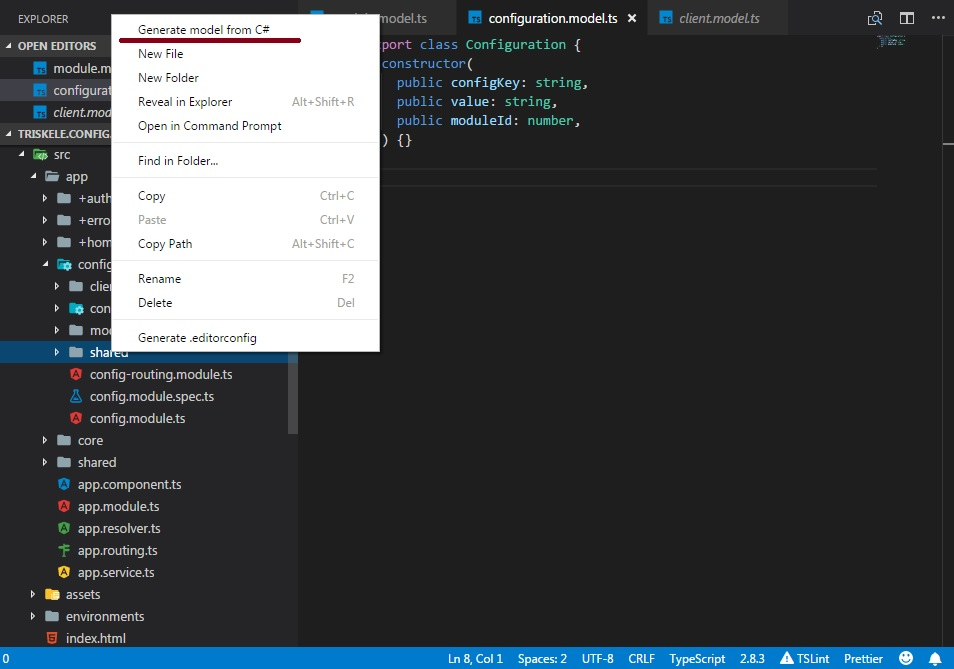

# generate-model README

This extension create TypeScript model from C# entity class.

## Features

You can create type with right click on a folder and selecting C# class file(s):

or just type "Generate Model" in Command Pallet

## Release Notes

### 0.0.1

Initial release

